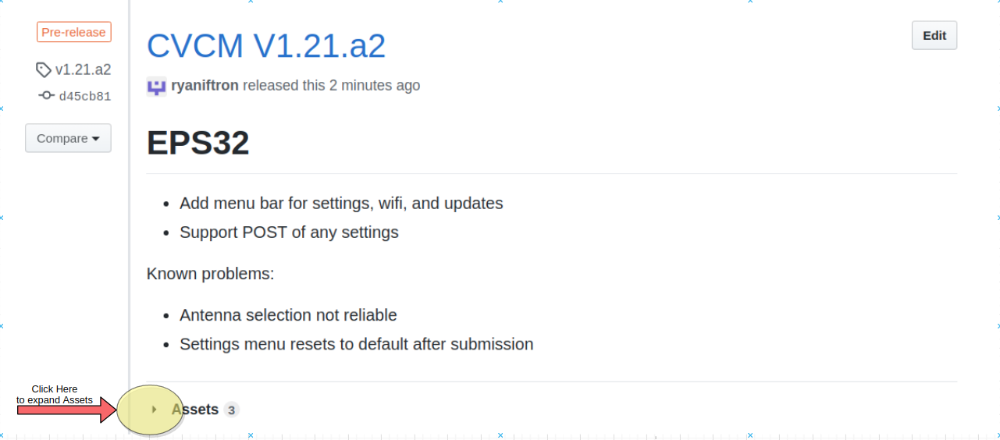
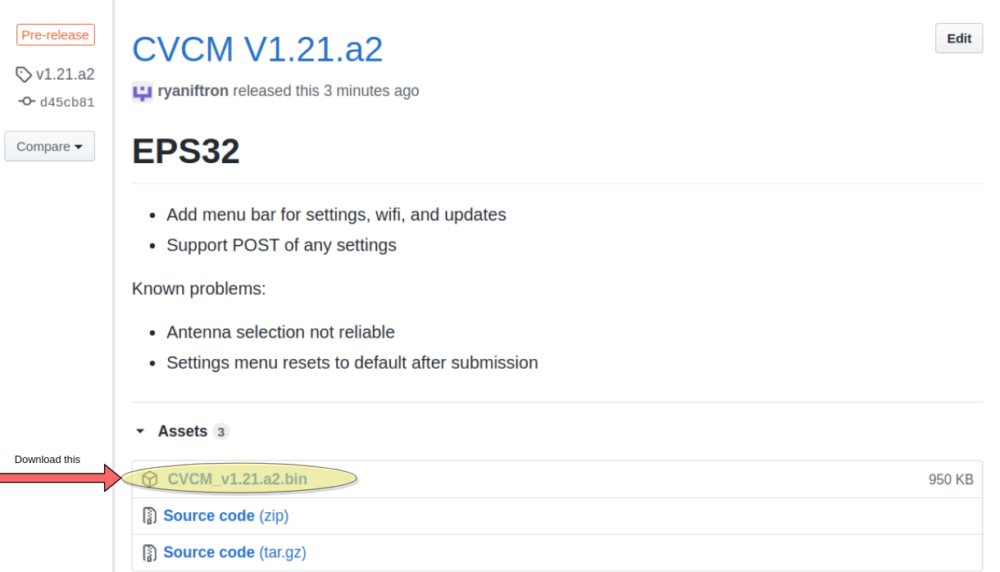
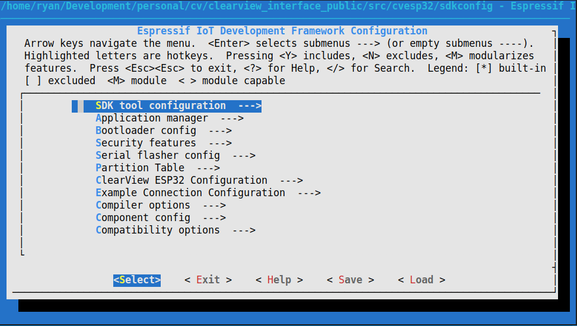
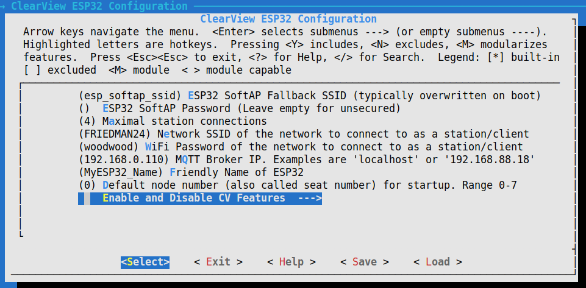
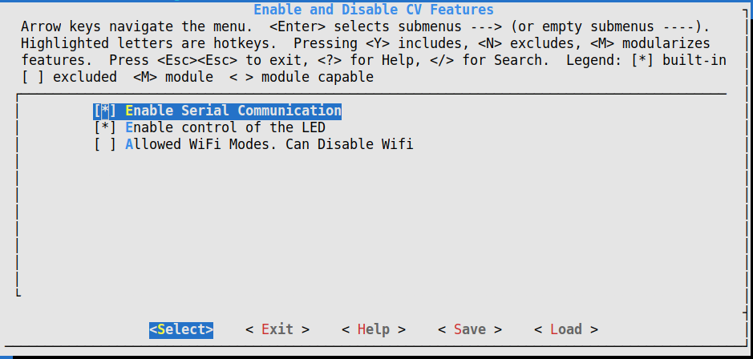
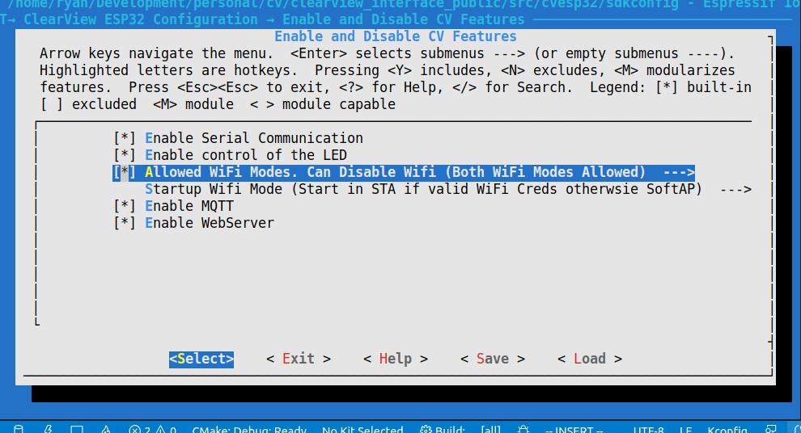
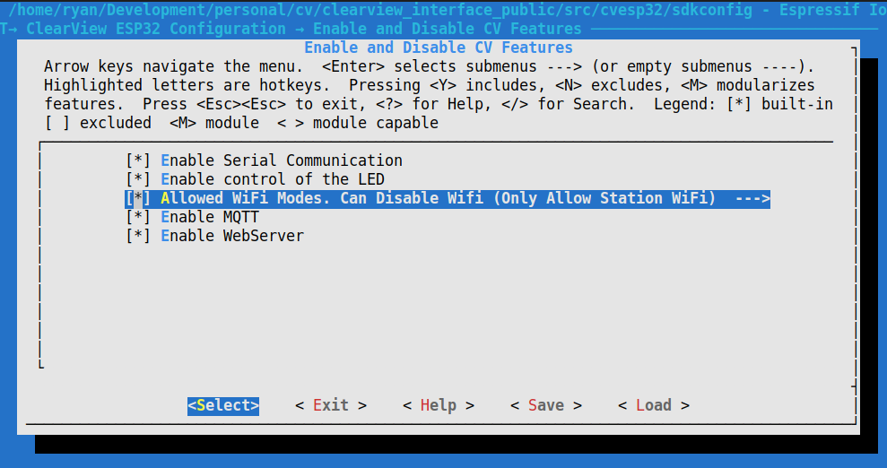
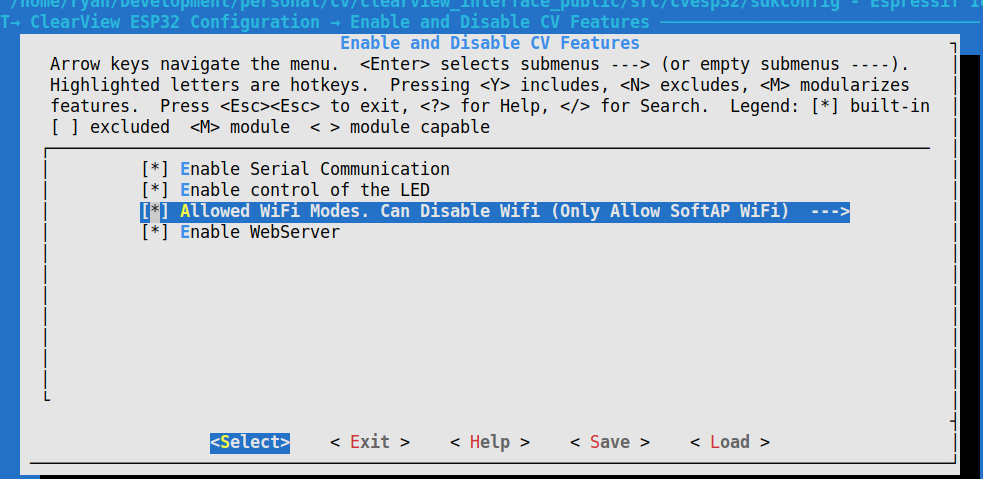

This document serves as a user manual for the CVCM Wireless Dongle. 

If this is your first time using the CVCM, start [here](#initial-connection) to connect your phone or laptop to the CVCM.

# User Manual Table of Contents

- [Usage Guide](#usage-guide)
  * [Home Page](#home-page)
  * [Settings Page](#settings-page)
  * [OTA Update Page](#ota-update-page)
- [Check Firmware Version](#check-firmware-version)
- [LED Codes](#led-codes)
- [Troubleshooting](#troubleshooting)
- [Developer Guide](#developer-guide)

<!-- toc -->

# Usage Guide
After updating firmware of CV2.0 and pushing the latest OTA file to the dongle, follow the processes below

## Initial Connection

1. Connect the dongle to the ClearView and power on the ClearView
1. The CVCM will generate a WiFi Network Hotspot and its own web site 
   * The CVCM SSID begins with "CV_" 
   * The network is unsecured (no password) and allows up to four devices to join
1. Using any laptop or phone with WiFi, go to the WiFi settings and join the network
1. Ignore any errors about not being connected to the internet. It's a local network.
1. Open a web browser and go to this web site [192.168.4.1](http://192.168.4.1) which is the home page of the CVCM

## Home Page 

1. If this is the first time connecting, the CVCM will "Slow Blink" to show it is in "Hotspot" mode
1. Go to the [home page](http://192.168.4.1), you can configure many common settings of the ClearView 2.0

## WiFi Page

1. In the WiFi configure your WiFi ssid, password, Friendly Name, MQTT Broker IP, and seat number
1. This is used for connecting to a lap timer like the RotorHazard lap timer

## OTA Update Page

For video instructions, watch this [video](https://youtu.be/DIWGuAUPeJM). Otherwise, follow the instructions below

1. Connect your phone or computer to the internet and download the latest CVCM Release [here](https://github.com/ryaniftron/clearview_interface_public/releases)
   * It is recommended to use stable builds unless otherwise instructed
1. Click the right arrow for "assets", and download the binary (.bin) file. Remember where you downloaded the file
    * Example: `CVCM_Beta_v0.0.1.bin`
    
    
1. Connect your phone or computer to the CVCM Wifi Network in your Wifi settings
1. Go to [192.168.4.1/ota](http://192.168.4.1/ota)
   * The OTA page displays what your current firmware version is and when it was compiled
1. Click "Browse" and locate your newly downloaded update binary
1. Click "Update Firmware" to start the automatic update
   * The CVCM gives progress bar and then reboots automatically when the update is complete

# Check Firmware Version

* Go to [192.168.4.1/ota](http://192.168.4.1/ota)
   * The OTA page displays what your current firmware version is and when it was compiled

# LED Codes
* Slow Blinking = Hotspot Mode, Errors exist and can be viewed
* Fast Blinking = Hotspot Mode, No errors
* Twinkling = Hotspot Mode, Connected Device
* Bright Solid = Attempting Connection to Network
* Slow Breathing = Connected to WiFi Network, Waiting for MQTT
* Twinkling with 3 flashes = Connected to WiFi Network and MQTT is Active

# Troubleshooting
* Can't connect to WiFi
  * ESP32 only connects to 2.4GHz networks
  * Credentials are incorrect
  * Recommended to log back into Hotspot when it fails back to that and view the error message

# Developer Guide

## Software: Initial Setup

1. Install espidf in the default location it recommends
1. Clone this repo
1. Linux Instructions
   * `$ source ~/esp/esp-idf/export.sh`
   * Or, add this line to ~/.bashrc
     * `$ alias esp='. ~/esp/esp-idf/export.sh'`
     * `$ source ~/.bashrc`
   * `$ cd $clearview_interface_public/src/cvesp32`
   * Connect ESP32 and find port using `$ dmesg | grep tty`
   * `$ idf.py build flash monitor -p /dev/ttyUSB<N>`, where `<N>` is your USB port number
      * example port: `/dev/ttyUSB1`

1. It should build the code, flash it to the ESP32, and then monitor the serial output of the ESP32

## Software: Configuring the ESP32 using Menuconfig

ESPIDF can use idf.py menuconfig to set the options for an ESP32. The default options are setup for what a customer would have set, but for development, there are settings to speed something up. 

Enter the menuconfig with the following. Ensure your terminal is full screen.
* `$ idf.py menuconfig`

Instructions for how to navigate are at the top of the menu.

Using arrow keys to navigate the menu, scroll down to `ClearView ESP32 Configuration` and select it. 

Feel free to adjust any of the top options. Some of these settings can be adjusted from the web server, but for development, it can be helpful to skip any setup phase and specify them here. 

Navigating to the `Enable and Disable CV Features` option, various functionalities can be turned off that the module uses. 

Both serial communication and the LED control can always disabled. 

For `Allowed WiFi Modes` WiFi can be enabled with `y` or disabled with `n`. When WiFi is disabled, there are no options for WiFi related features, as seen in [MenuWifiDisabled]

If enabled, there are three options for WiFi Modes because of the two physical interfaces, SoftAP and Station. SoftAP is also commonly known as Hotspot. 

If enabled, hit enter to view the three choices. Normally, both WiFi modes will be allowed, as seen below.

When both WiFi modes are allowed `Startup WiFi Mode`, `MQTT`, and `WebServer` show up

The WiFi can be limited to `Station Only`. `MQTT`  and `WebServer` are still available but `Startup` disappears.

In `SoftAP` only, the `WebServer` option is available but `MQTT` and `Startup` are gone, as shown below.

The following table sums up the options

| WiFi Modes   | Startup Mode | MQTT     | WebServer                         |
|--------------|--------------|----------|-----------------------------------|
| Disable WiFi | (hidden)     | (hidden) | (hidden)                          |
| Both         | (available)  | (avail)  | [Both, Station Only, SoftAP Only] |
| Station Only | (hidden)     | (avail)  | [Station Only]                    |
| SoftAP Only  | (hidden)     | (hidden) | [SoftAP Only]                     |

Typically the ESP32 starts in SoftAP mode and allows configuration unless it has valid stored credentials to join another AP as a client. This behavior can be overwritten here. 

MQTT allows communication with other devices like lap timers on the wireless network.

The WebServer the CV generates can also be turned off, or customized which WiFi mode it is allowed on. The WebServer is only allowed on WiFi interfaces that are enabled.

